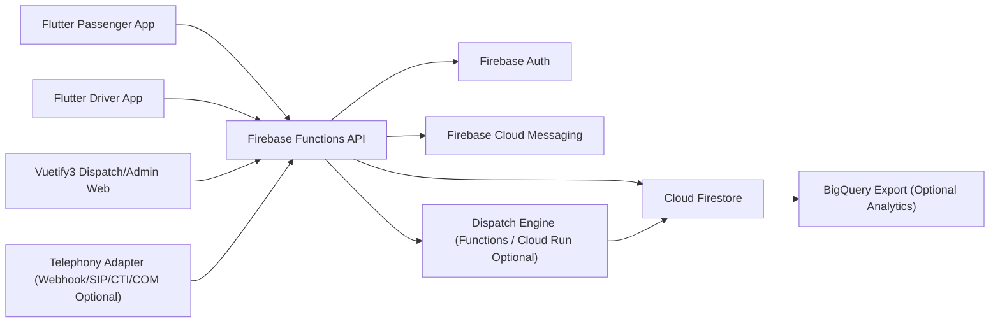

# Reqmo 設計書（Draft v0.2）

最終更新日: 2026-02-14  
対象: Reqmo Core（オープンソースのオンデマンド配車システム）

---

## 1. 目的とスコープ

Reqmo は、地域交通向けのオンデマンド配車システムであり、以下を同時に満たすことを目的とする。

- 乗車・降車地点を「固定ポイント（例: バス停）」でも「自由地点（任意座標）」でも受け付ける
- 低運用コストで導入できる（Firebase ベース）
- オープンソースとして再利用しやすい構造を持つ
- 相乗り（プーリング）と即時配車/予約配車を両立する
- 運行ポリシーを設定駆動で切り替え、地域ごとの要件差を吸収する
- アプリ/Web だけでなく電話チャネル（着信）からの受付にも対応する

本設計書は、以下の実装前提で作成する。

- バックエンド: Firebase（Auth / Firestore / Cloud Functions / Cloud Messaging / Storage）
- Web フロント: Vue 3 + Vuetify 3
- モバイル: Flutter（Passenger アプリ / Driver アプリ）

---

## 2. 想定ユーザーと役割

- 乗客（Passenger）
- ドライバー（Driver）
- 運行管理者（Dispatcher）
- 事業管理者（Admin）

---

## 3. システムゴール/非ゴール

### 3.1 ゴール

- 複数車両に対してリアルタイムに配車最適化
- 固定点/自由点の混在リクエストに対応
- 完全自由点と仮想停留所を同一サービス内で併用可能
- 電話番号ベースでの本人特定・予約受付・配車依頼作成を可能にする
- 運行状況、需要、遅延の可視化
- マルチテナント展開（自治体/事業者ごと）

### 3.2 非ゴール（初期フェーズ）

- 完全自動運賃精算の法令対応（地域固有制度は後続）
- 高速道路/有料道路課金の厳密最適化
- 長距離都市間輸送

---

## 4. 要求仕様

### 4.1 機能要件（FR）

- FR-001: 乗客は即時配車または予約配車を作成できる
- FR-002: 乗車地点・降車地点は以下 4 パターンを許容する  
  1. 固定 -> 固定  
  2. 固定 -> 自由  
  3. 自由 -> 固定  
  4. 自由 -> 自由
- FR-003: システムは受領した地点の妥当性（営業エリア内、安全停車可否）を判定する
- FR-004: システムは配車候補（車両）を算出し、最適な車両へ割り当てる
- FR-005: ドライバーはタスク（迎車/乗車/降車）を順次実行し、状態遷移を報告できる
- FR-006: 管理画面で車両位置、リクエスト、遅延、配車結果を監視できる
- FR-007: 需要データに基づく再配車・再最適化を一定間隔で実行できる
- FR-008: 通知（受付、到着予測、乗車開始、完了、キャンセル）を配信できる
- FR-009: キャンセルポリシーと no-show 記録を保持できる
- FR-010: 監査ログ（誰がいつ変更したか）を保持できる
- FR-011: 管理者は地点解決ポリシーを設定できる（完全自由点/仮想停留所/ハイブリッド）
- FR-012: 管理者は予約許容日数、予約締切、当日受付条件を設定できる
- FR-013: 管理者は運行車両台数上限・稼働車両の有効化ルールを設定できる
- FR-014: 管理者は乗合上限（同乗人数、最大迂回、追加立寄り回数）を設定できる
- FR-015: 管理者は運賃モデル（固定/距離/時間/ゾーン/ハイブリッド）を選択・切替できる
- FR-016: 設定変更はバージョン管理され、将来時刻に予約適用できる
- FR-017: システムは電話番号をユーザー識別子として登録・照合できる
- FR-018: 着信イベントをテレフォニー連携経由で受信し、発信者番号を保存できる
- FR-019: 電話受付（IVR/オペレーター）から配車依頼を作成できる
- FR-020: テレフォニー連携方式は複数選択可能とし、COM ポート依存を必須にしない
- FR-021: 発信者番号未通知・不正形式・重複番号の扱いをポリシーで設定できる

### 4.2 非機能要件（NFR）

- NFR-001: リクエスト受領から初回配車候補決定まで P95 5 秒以内
- NFR-002: 通知遅延 P95 3 秒以内（FCM 到達はネットワーク依存）
- NFR-003: 稼働率 99.9%（Firebase SLA 依存）
- NFR-004: 個人情報の最小化と暗号化（転送/保存）
- NFR-005: 1 テナントあたり同時アクティブ車両 500 台規模まで水平拡張可能
- NFR-006: 配車ロジックは差し替え可能（戦略パターン）
- NFR-007: 設定変更は無停止で反映できる（有効時刻ベース）
- NFR-008: 着信イベント受信から caller 解決完了まで P95 3 秒以内
- NFR-009: テレフォニー連携停止時も他チャネル（アプリ/Web）は継続稼働する

---

## 5. 全体アーキテクチャ



### 5.1 コンポーネント責務

- Flutter Passenger
- 配車依頼作成、予約確認、リアルタイム追跡、通知受信

- Flutter Driver
- 稼働状態変更、受注/拒否、ナビ連携、乗降ステータス更新

- Vuetify3 Web（Dispatcher/Admin）
- 手動配車、監視、運行 KPI、マスタ管理（停留所/営業エリア/ポリシー）

- Firebase Functions（API + Orchestrator）
- リクエスト受付、検証、配車実行、状態遷移、通知、監査ログ生成

- Firestore
- リアルタイム状態管理（運行中エンティティ）

- Dispatch Engine
- 配車アルゴリズム本体（初期は Functions 内、負荷増時は Cloud Run 分離）

- Telephony Adapter Layer
- 電話基盤から着信イベントを正規化し、Reqmo API に転送（COM は任意アダプタとして扱う）

---

## 6. データモデル（Firestore）

テナント分離前提: `/tenants/{tenantId}/...`

### 6.1 主要コレクション

1. `tenants/{tenantId}/users/{userId}`
- role: `passenger | driver | dispatcher | admin`
- profile, contact, accessibilityNeeds

2. `tenants/{tenantId}/vehicles/{vehicleId}`
- capacity, wheelchairCapacity, status, lastLocation, telemetry
- assignedDriverId, serviceTags

3. `tenants/{tenantId}/stops/{stopId}`
- name, lat, lng, geohash, stopType, accessibility

4. `tenants/{tenantId}/serviceAreas/{areaId}`
- polygon, rules（freePickupAllowed, freeDropoffAllowed）
- restrictedZones（学校周辺、幹線道路等）

5. `tenants/{tenantId}/rideRequests/{requestId}`
- requesterId
- pickup:
  - mode: `FIXED_STOP | FREE_POINT`
  - stopId? / latLng?
  - resolvedPoint（検証後の採用地点）
- dropoff: pickup と同構造
- requestedAt, scheduledAt, latestArrival, partySize, specialNeeds
- status: `REQUESTED | VALIDATING | MATCHING | ASSIGNED | PICKED_UP | COMPLETED | CANCELED | REJECTED`
- assignment: vehicleId?, etaPickup?, etaDropoff?, score?

6. `tenants/{tenantId}/trips/{tripId}`
- vehicleId, driverId, stopPlan（ordered tasks）
- onboardPassengers, routePolyline, status

7. `tenants/{tenantId}/dispatchJobs/{jobId}`
- requestIds[], algorithm, result, executionMs, fallbackUsed

8. `tenants/{tenantId}/auditLogs/{logId}`
- actor, action, target, before, after, timestamp

9. `tenants/{tenantId}/dispatchPolicies/{policyId}`
- maxWaitMinutes, maxDetourMinutes, maxPickupDistanceMeters
- reoptimizationIntervalSec, algorithmPrimary, algorithmFallback
- dynamicPolicy（peakHours, badWeatherMode, eventMode）

10. `tenants/{tenantId}/serviceProfiles/{profileId}`
- effectiveFrom, effectiveTo, status（`DRAFT | ACTIVE | ARCHIVED`）
- locationPolicy:
  - freePointEnabled
  - virtualStopEnabled
  - defaultResolutionMode（`AUTO | FREE_POINT | VIRTUAL_STOP`）
  - autoSwitchRules（peakHoursUseVirtualStop など）
- reservationPolicy:
  - maxAdvanceDays
  - minLeadMinutes
  - sameDayCutoffLocalTime
- fleetPolicy:
  - maxActiveVehicles
  - minStandbyVehicles
  - activationStrategy（`MANUAL | DEMAND_BASED`）
- poolingPolicy:
  - enabled
  - maxOnboardPerVehicle
  - maxDetourMinutes
  - maxAdditionalStops
- farePolicyRef
- dispatchPolicyRef

11. `tenants/{tenantId}/farePolicies/{farePolicyId}`
- model（`FIXED | DISTANCE | TIME | ZONAL | HYBRID | PLUGIN`）
- params（model ごとの係数）
- currency, taxPolicy, roundingRule
- effectiveFrom, effectiveTo

12. `tenants/{tenantId}/phoneIdentities/{phoneIdentityId}`
- normalizedPhoneE164（例: `+818012345678`）
- userId
- source（`APP_VERIFIED | INBOUND_CALL | OPERATOR_REGISTERED`）
- verified, lastSeenAt, blockStatus

13. `tenants/{tenantId}/callEvents/{callEventId}`
- provider, adapterType（`WEBHOOK | SIP | CTI | SERIAL_COM`）
- direction（`INBOUND | OUTBOUND`）
- callerRaw, callerE164, receiverNumber
- receivedAt, ringAt, connectedAt, endedAt
- linkedUserId, linkedRideRequestId
- status（`RECEIVED | LINKED | FAILED | IGNORED`）
- rawPayloadRef（Storage）

14. `tenants/{tenantId}/telephonyConfigs/{configId}`
- providerName, adapterType, endpoint, authSecretRef
- enabled, failoverConfig, parsingRules（国番号補完など）

### 6.2 インデックス設計（例）

- `rideRequests`: `status + requestedAt`
- `rideRequests`: `pickup.geohash + status`
- `rideRequests`: `timeWindow.scheduledAt + status`
- `phoneIdentities`: `normalizedPhoneE164 + userId`
- `callEvents`: `callerE164 + receivedAt`
- `vehicles`: `status + lastLocation.geohash`
- `trips`: `status + updatedAt`

### 6.3 状態遷移ルール

- `REQUESTED -> VALIDATING -> MATCHING -> ASSIGNED`
- ドライバー到着で `ARRIVED`（オプション状態）
- 乗車処理で `PICKED_UP`
- 全員降車で `COMPLETED`
- 途中キャンセルで `CANCELED`
- マッチ不能で `REJECTED`

状態遷移は Functions 経由に限定し、クライアント直接更新を禁止する。

### 6.4 `rideRequests` 推奨スキーマ（詳細）

`channel` は `PASSENGER_APP | DISPATCHER_WEB | PHONE_IVR | PHONE_OPERATOR` を想定する。

```json
{
  "tenantId": "tenant_default",
  "requesterId": "user_123",
  "channel": "PASSENGER_APP",
  "pickup": {
    "mode": "FREE_POINT",
    "stopId": null,
    "inputPoint": {"lat": 33.0001, "lng": 132.9001},
    "resolvedPoint": {"lat": 33.0002, "lng": 132.9003},
    "resolutionMode": "AUTO",
    "resolvedAs": "FREE_POINT",
    "validation": {
      "insideServiceArea": true,
      "safeToStop": true,
      "ruleVersion": "2026-02-14"
    }
  },
  "dropoff": {
    "mode": "FIXED_STOP",
    "stopId": "stop_74",
    "inputPoint": null,
    "resolvedPoint": {"lat": 33.0101, "lng": 132.9054}
  },
  "partySize": 1,
  "specialNeeds": {"wheelchair": false},
  "timeWindow": {
    "requestType": "ASAP",
    "scheduledAt": null,
    "latestPickupAt": "2026-02-14T10:32:00Z",
    "latestDropoffAt": null
  },
  "status": "MATCHING",
  "assignment": {
    "vehicleId": null,
    "tripId": null,
    "etaPickupSec": null,
    "etaDropoffSec": null,
    "score": null
  },
  "dispatchMeta": {
    "attemptCount": 1,
    "lastTriedAt": "2026-02-14T10:20:10Z",
    "primaryAlgorithm": "INSERTION",
    "fallbackAlgorithm": "GREEDY",
    "serviceProfileId": "weekday_default_v1"
  },
  "createdAt": "2026-02-14T10:20:00Z",
  "updatedAt": "2026-02-14T10:20:10Z"
}
```

### 6.5 `callEvents` 推奨スキーマ（詳細）

```json
{
  "tenantId": "tenant_default",
  "provider": "asterisk",
  "adapterType": "SIP",
  "direction": "INBOUND",
  "callerRaw": "08012345678",
  "callerE164": "+818012345678",
  "receiverNumber": "+818801112222",
  "receivedAt": "2026-02-14T10:20:00Z",
  "status": "LINKED",
  "linkedUserId": "user_123",
  "linkedRideRequestId": "req_987",
  "rawPayloadRef": "gs://reqmo-tenant-default/call-events/evt_001.json"
}
```

---

## 7. 地点入力仕様（固定点/自由点）

### 7.1 入力モード

- 固定点: 停留所 ID 指定（`stopId`）
- 自由点: 地図タップ/住所検索で座標指定（`lat,lng`）

### 7.2 検証パイプライン

1. 座標正規化（小数桁、EPSG:4326）
2. 営業エリア内判定（Polygon contains）
3. 禁止エリア判定（学校敷地、高速本線など）
4. 安全停車可能判定（道路種別、停車余地、UTurn リスク）
5. ルート探索サービスで到達可能性確認
6. 必要に応じてスナップ補正（道路端点へ補正）

### 7.3 自由点の扱い方針

- 方針 A: 完全自由点（そのまま乗降ポイント採用）
- 方針 B: 仮想停留所化（近傍に `virtualStop` を生成して最適化）
- 方針 C: 既存停留所への誘導（閾値内なら固定点へ変換）

### 7.4 共存モード（設定可能）

- `FREE_ONLY`: 完全自由点のみ許可
- `VIRTUAL_ONLY`: 仮想停留所のみ許可
- `HYBRID`: 両方を許可し、`AUTO` で都度選択
- `HYBRID` 時は passenger の希望（自由点優先/仮想停留所優先）をオプション入力として受け取れる

推奨デフォルト: `HYBRID`

### 7.5 `HYBRID` の解決ルール

1. 入力地点から自由点候補と仮想停留所候補を同時生成
2. 候補ごとに安全性・到達性・ETA・既存便への影響を評価
3. `Cost` 最小の方式を `resolvedAs` に採用
4. 採用理由を `rideRequests.pickup.validation` に記録（監査可能）

### 7.6 時間帯/混雑連動の自動切替

- `serviceProfiles` の `autoSwitchRules` により時間帯で切替可能
- 例: 平日朝ピークは `VIRTUAL_STOP` 優先、夜間は `FREE_POINT` 優先

---

## 8. 配車アルゴリズム設計

Reqmo は戦略切替可能な構成にし、需要規模や運行ポリシーでアルゴリズムを選択する。

### 8.1 共通制約

- 車両定員超過禁止
- 乗客の最大待ち時間上限
- 既存乗客の最大迂回時間上限
- ドライバー勤務制約（休憩、終業）
- バリアフリー要件（車いす対応）
- 予約受付範囲（`maxAdvanceDays` / `sameDayCutoffLocalTime`）
- 稼働車両数上限（`maxActiveVehicles`）
- 乗合上限（`maxOnboardPerVehicle` / `maxAdditionalStops`）

### 8.2 評価関数（例）

`Cost = a*pickupDelay + b*inVehicleDetour + c*deadheadDistance + d*latenessPenalty - e*poolingGain`

- `pickupDelay`: 依頼から乗車まで
- `inVehicleDetour`: 直行時間との差分
- `deadheadDistance`: 空走距離
- `latenessPenalty`: 希望到着時刻超過
- `poolingGain`: 同時輸送効率

### 8.3 アルゴリズム案（複数）

1. Greedy Nearest Feasible
- 内容: 制約を満たす最寄り車両へ即時割当
- 長所: 実装容易、高速
- 短所: 全体最適になりにくい
- 適用: 小規模運行、PoC

2. Incremental Insertion Heuristic（DARP 近似）
- 内容: 各車両ルートへの pickup/dropoff 挿入位置を総当たり評価
- 長所: 即時性と品質のバランスが良い
- 短所: 台数・タスク増で計算量増
- 適用: 中規模運行（推奨初期本番）

3. Regret-k Insertion + Re-optimization
- 内容: 挿入候補の後悔値（regret）で優先順位付けし、一定間隔で全体再最適化
- 長所: 需要ピーク時に取りこぼしを減らしやすい
- 短所: 実装複雑
- 適用: 需要変動が大きい地域

4. Rolling Horizon Optimization（MILP/CP-SAT）
- 内容: 30〜120 秒ごとに時間窓付き最適化を解く
- 長所: 品質最良
- 短所: 計算資源・実装難易度が高い
- 適用: 大規模化後、Cloud Run 分離時

### 8.4 推奨導入順

1. フェーズ 1: Greedy + 安全制約
2. フェーズ 2: Incremental Insertion（標準）
3. フェーズ 3: Regret-k + 再最適化
4. フェーズ 4: Rolling Horizon（必要時のみ）

### 8.5 固定点/自由点混在時の最適化アイデア

1. Virtual Stop Clustering
- 自由点を近傍クラスタにまとめ、仮想停留所ノードとして扱う

2. Two-layer Graph
- 上位層: 停留所ネットワーク  
- 下位層: 自由点アクセス（ラスト 200m など）

3. Adaptive Constraint
- 混雑時は自由点を「許容半径内の停留所へ誘導」して計算安定化
- 閑散時は完全自由度を開放

### 8.6 標準アルゴリズム（Incremental Insertion）実行手順

1. 対象抽出
- `MATCHING` 状態リクエストを取得（作成時刻順）

2. 候補車両抽出
- リクエスト乗車地点近傍の稼働車両を geohash 近傍探索
- 定員・設備要件に合わない車両を除外

3. ETA 行列作成
- 候補車両の現行ルート各ノードと、新規 pickup/dropoff 間の移動時間を取得

4. 挿入評価
- `pickup` を挿入可能な位置 i、`dropoff` を i より後ろの位置 j に挿入
- すべての `(i, j)` を評価し、制約違反を除外
- 最小コスト案を車両ごとに 1 つ保存

5. 最終選択
- 全車両の最良案からグローバル最小コストを採用
- 同点時は `待ち時間最小 -> 既存乗客迂回最小 -> 空走最小` で決定

6. 割当コミット
- Transaction で `rideRequests` と `trips` を同時更新
- 更新成功後に乗客/ドライバーへ通知

### 8.7 フォールバック戦略

- Fallback-1: 制約緩和（許容待機時間 +2 分、ただし上限あり）
- Fallback-2: 単独輸送優先（プーリング利得の重みを下げる）
- Fallback-3: 手動配車キューへ転送
- Fallback-4: マッチ不能として `REJECTED`、代替案（近傍停留所）提示

### 8.8 アルゴリズム設定パラメータ（初期案）

- `max_wait_min = 15`
- `max_detour_min = 10`
- `reoptimization_interval_sec = 60`
- `candidate_vehicle_limit = 30`
- `weights = {pickupDelay: 0.4, detour: 0.25, deadhead: 0.2, lateness: 0.15}`

上記は初期値であり、すべて `serviceProfiles` / `dispatchPolicies` で変更可能とする。

### 8.9 擬似コード（概略）

```text
for request in matchingRequests:
  candidates = findCandidateVehicles(request)
  bestPlan = null
  for vehicle in candidates:
    plan = bestInsertionPlan(vehicle, request)
    if feasible(plan):
      bestPlan = minCost(bestPlan, plan)
  if bestPlan:
    commitAssignment(bestPlan)
  else:
    runFallback(request)
```

### 8.10 設定駆動制御の原則

- 配車・地点解決・乗合・予約・運賃の各ルールは `serviceProfiles` を唯一の参照元にする
- リクエスト作成時に有効な `serviceProfileId` をスナップショット保存する
- 進行中リクエストは原則「作成時の設定」を保持し、後追い設定変更で不整合を防止
- 重大障害時のみ Dispatcher が手動で profile override 可能
- 電話番号照合ルール（正規化、重複解決、拒否番号）も `serviceProfiles` または `telephonyConfigs` で設定管理する

---

## 9. API / イベント設計

### 9.1 Functions API（例）

- `createRideRequest()`
- `cancelRideRequest()`
- `acceptAssignment()` / `rejectAssignment()`
- `updateDriverLocation()`
- `updateTripTaskStatus()`
- `manualDispatch()`
- `rerunDispatch(jobId)`
- `upsertServiceProfile()`
- `activateServiceProfile(profileId, effectiveFrom)`
- `upsertFarePolicy()`
- `previewFare(requestDraft)`
- `ingestCallEvent()`
- `resolveCallerIdentity()`
- `createRideRequestByPhone()`
- `linkPhoneIdentity(userId, phoneNumber)`
- `upsertTelephonyConfig()`

### 9.2 イベントトリガー

- `onRideRequestCreated`: 検証 -> マッチング起動
- `onDriverLocationUpdated`: ETA 再計算
- `onTripStatusChanged`: 乗客通知、KPI 更新
- `scheduledReoptimization`（Cloud Scheduler）: 再最適化

### 9.3 同時更新制御

- Firestore Transaction で車両割当競合を制御
- `assignmentVersion` を持ち楽観ロック
- 冪等キー（`requestId + actionType`）で二重実行防止

### 9.4 配車フロー（時系列）

1. Passenger App が `createRideRequest()` 呼び出し
2. Functions が有効 `serviceProfile` を解決し、予約/地点/乗合/車両上限を検証
3. 地点解決（`FREE_POINT` / `VIRTUAL_STOP` を同時評価）を実行
4. `rideRequests` を `MATCHING` で保存（`serviceProfileId` を含む）
5. Dispatch Engine が候補車両探索
6. 最適案を Transaction で `ASSIGNED` へ更新
7. Driver App に受注通知
8. Driver 承諾後、Trip へタスク反映
9. 乗客へ到着予測通知

### 9.5 エラーハンドリング指針

- クライアント入力エラー: 4xx（入力修正を促す）
- 一時的失敗（ルーティング API 失敗）: リトライ（指数バックオフ）
- 割当競合: Transaction 再試行 3 回
- 最終失敗: 監査ログ記録 + Dispatcher 画面にアラート表示

### 9.6 電話連携フロー（COM 非依存）

1. 電話基盤（PBX/CTI/クラウド通話 API）が着信を検知
2. テレフォニーアダプタがイベントを Reqmo の `ingestCallEvent()` へ転送
3. Reqmo が電話番号を E.164 正規化し、`phoneIdentities` と照合
4. 一致時は既存ユーザーとして `linkedUserId` を付与
5. 不一致時は `unknown caller` としてオペレーター UI に表示し、仮登録可
6. IVR またはオペレーター操作で `createRideRequestByPhone()` を実行
7. `rideRequests.channel = PHONE_IVR | PHONE_OPERATOR` で保存し通常配車へ接続

### 9.7 連携方式（実装オプション）

- Option A: Webhook 連携（Twilio/Plivo/クラウド PBX）
- Option B: SIP/PBX 連携（Asterisk/FreePBX などのイベントフック）
- Option C: CTI 連携（コールセンター基盤）
- Option D: Serial(COM) 連携アダプタ（既存資産移行用、任意）

推奨は Option A または B。Option D は後方互換として保持する。

---

## 10. クライアント設計

### 10.1 Flutter Passenger App

- 画面: 依頼作成、マップ選択、見積 ETA、進行状況、履歴
- 必須機能:
  - pickup/dropoff の mode 切替（固定/自由）
  - 乗降位置の安全性ガイド（警告/再選択）
  - 通知ハンドリング（到着前リマインド）

### 10.2 Flutter Driver App

- 画面: 受注一覧、現在タスク、ナビ連携、乗降確認
- 必須機能:
  - 稼働開始/終了、休憩状態
  - 乗車コード確認（誤乗車防止）
  - オフライン時キュー送信

### 10.3 Vuetify3 Dispatcher/Admin Web

- Dispatcher:
  - リアルタイム地図（車両、依頼、遅延ヒート）
  - 手動差し替え配車
  - 運行アラート（遅延、no-show）
  - 着信キュー（未登録番号、オペレーター対応状況、通話ログ）

- Admin:
  - 停留所/営業エリア管理
  - サービス設定（地点ポリシー、予約日数、車両上限、乗合上限、運賃モデル）
  - プロファイルバージョン管理（下書き、予約適用、ロールバック）
  - テレフォニー設定（プロバイダ、アダプタ種別、番号正規化ルール）
  - KPI ダッシュボード

---

## 11. セキュリティと権限

### 11.1 認証

- Firebase Auth（Email/Password, SMS, OIDC）
- Driver/Admin は MFA 推奨
- 電話番号連携時は caller ID のみで本人確定せず、必要に応じて追加確認（PIN/生年月日）を要求

### 11.2 認可

- Custom Claims + Firestore Rules
- テナント境界を必須チェック
- 重要操作（手動配車、ポリシー変更）は管理権限のみ

### 11.3 データ保護

- PII を分離保存（連絡先を最小化）
- 監査ログの改ざん防止（append-only）
- 保存期間ポリシー（例: 位置履歴 90 日）
- 通話イベント payload は最小保存、機微情報はマスキングして保管

---

## 12. 監視・運用

- Firebase Analytics / Crashlytics
- Cloud Logging（構造化ログ）
- 主要メトリクス:
  - マッチ成功率
  - 平均待ち時間
  - 平均迂回時間
  - 車両稼働率
  - キャンセル率 / no-show 率

アラート条件例:

- マッチ失敗率 > 20%（5 分窓）
- ETA 誤差 P95 > 8 分
- Functions エラー率 > 2%

---

## 13. テスト戦略

### 13.1 バックエンド

- ユニット: 制約判定、スコア計算、状態遷移
- 統合: Firestore Emulator + Functions Emulator
- 負荷: 同時リクエスト 1,000 件相当シミュレーション
- 連携試験: `ingestCallEvent()` での番号正規化、重複照合、unknown caller 分岐

### 13.2 フロント（Vuetify3）

- コンポーネントテスト（Vitest）
- E2E（Playwright）で配車監視フロー

### 13.3 モバイル（Flutter）

- Widget Test
- Integration Test（乗降フロー）
- 疎通試験（通知、位置更新、再接続）

### 13.4 アルゴリズム検証

- 過去需要データ再生（Replay）
- A/B 比較（Greedy vs Insertion）
- 指標: 待ち時間、空走、乗合率、計算時間
- ルール差分比較: `serviceProfile` 切替前後の KPI 比較

---

## 14. リリース計画（提案）

1. M1: 基本配車（固定点のみ、Greedy）
2. M2: 自由点入力 + 仮想停留所 + `HYBRID` 解決
3. M3: 設定駆動 `serviceProfiles`（予約/車両/乗合/運賃）
4. M4: Insertion 最適化 + 再最適化
5. M5: 管理画面強化 + KPI + マルチテナント OSS 整備

---

## 15. OSS 方針（提案）

- ライセンス: `Apache-2.0` または `MIT`
- コントリビューション: `CONTRIBUTING.md`, `CODE_OF_CONDUCT.md`
- 拡張点:
  - Dispatch Strategy Interface
  - Map/Routing Provider Adapter
  - Fare Policy Plugin

---

## 16. 未確定事項（確認したい点）

本仕様では、以下はすべて設定可能項目として扱う。

1. 自由点と仮想停留所の利用モード（`FREE_ONLY | VIRTUAL_ONLY | HYBRID`）
2. 予約ポリシー（許容日数、当日締切、最短リード時間）
3. 稼働車両ポリシー（最大稼働台数、待機台数、有効化戦略）
4. 乗合ポリシー（同乗上限、最大迂回、追加立寄り上限）
5. 運賃ポリシー（固定/距離/時間/ゾーン/ハイブリッド/プラグイン）
6. 電話連携ポリシー（Webhook/SIP/CTI/COM 互換、caller ID 未通知時の扱い）

残る確認事項は以下。

1. 初期デフォルト値（プロファイル `weekday_default_v1` の初期パラメータ）
2. 外部地図/経路エンジン（OSM + OSRM / 商用 API 併用可否）
3. 地域法令に基づく運賃制約（上限、割引、補助制度連携）
4. 電話事業者/電話基盤の初期選定（既存 PBX 連携有無）

---

## 17. 次アクション

- `serviceProfiles` と `farePolicies` の Firestore スキーマを JSON Schema 化
- Admin Web の設定画面（プロファイル編集/予約適用/ロールバック）を設計
- 配車エンジンで `serviceProfileId` の参照とスナップショット固定を実装
- API 契約（入出力 JSON）を OpenAPI 形式で定義
- テレフォニーアダプタ IF（Webhook/SIP/CTI/COM 互換）の共通インターフェースを定義

---

## 18. 実装仕様（配車アルゴリズム）

### 18.1 現在の実装方針

- 一次アルゴリズム: `INSERTION`（挿入法）
- フォールバック: `GREEDY`
- 候補車両上限: `candidateVehicleLimit`
- スコア重み: `dispatchPolicy.weights`

上記は `serviceProfile.dispatchPolicy` で制御し、API 実行時に読み込む。

### 18.2 ルート評価に使う移動時間

- 乗降時刻（ETA）と挿入コスト計算は、道路経路ベースの移動時間を優先して使用する
- 経路プロバイダが利用不可の場合は、直線距離ベース（haversine）に自動フォールバックする
- ルーティング解決はバックエンドの `routing/service.js` で抽象化する

### 18.3 配車評価フロー（実装）

1. 予約の pickup/dropoff を地点解決（固定点/自由点/仮想停留所）
2. 対象車両 + 予約地点を用いて移動時間推定器（travel estimator）を生成
3. `INSERTION` で候補を評価（失敗時 `GREEDY`）
4. 最良案の ETA と既存予約影響をシミュレーション出力
5. 確定時に車両ルート・予約 assignment・trip を更新

### 18.4 キャンセル/再最適化時の扱い

- 予約取消時:
  - 対象予約のタスクを車両ルートから除去
  - 残タスクに対して ETA を再計算
  - 影響予約の ETA を更新
- 車両現在地更新時:
  - 新しい車両位置を起点に再最適化を実施
  - 既存割当予約の ETA を再計算して反映

### 18.5 主要 API（実装）

- `POST /api/ride-requests/preview`
  - 予約追加シミュレーション（担当車両、乗降予定時刻、既存予約影響、運行手順）
- `POST /api/ride-requests`
  - シミュレーション結果を前提に予約確定
- `POST /api/ride-requests/{requestId}/cancel`
  - 予約取消 + 影響再計算
- `POST /api/vehicles/{vehicleId}/location`
  - 車両現在地更新 + 再最適化

### 18.6 ルーティング設定（環境変数）

- `ROUTING_PROVIDER`
  - `OSRM` または `STRAIGHT_LINE`
- `ROUTING_OSRM_BASE_URL`
  - 例: `https://router.project-osrm.org`
- `ROUTING_REQUEST_TIMEOUT_MS`
  - ルーティング API タイムアウト（ms）

`docker-compose.yml` ではデフォルトで `ROUTING_PROVIDER=OSRM` を設定する。

---

## 19. 実装仕様（地図データ・経路データ）

### 19.1 地図表示のデータソース

- 背景地図タイル:
  - OpenStreetMap タイル（Leaflet）
- 停留所:
  - `stops` データ（seed/Firestore）
- 車両現在地:
  - `vehicles.currentLocation`
- 予約地点:
  - `rideRequests` の pickup/dropoff 解決座標

### 19.2 経路ポリラインの取得

- UI は直線を固定表示せず、`POST /api/routing/path` で道路経路ポリライン取得を試行する
- リクエスト点列をバックエンドへ送信し、OSRM route API で geometry を取得する
- 取得失敗時は直線ポリラインで表示継続（可用性優先）

### 19.3 `POST /api/routing/path` の役割

- 入力:
  - `points: [{lat, lng}, ...]`
- 出力:
  - `source: "OSRM" | "STRAIGHT_LINE"`
  - `polyline: [{lat, lng}, ...]`
  - `durationMinutes`
  - `distanceMeters`

### 19.4 フロント実装上の注意点

- 同一路線の再取得を抑えるため、ルート geometry はメモリキャッシュする
- キャッシュ未命中時は暫定表示（直線）を行い、取得後に再描画する
- 連続失敗時は短時間リトライ抑制を行う

### 19.5 地図データの精度とフォールバック

- OSRM 利用時:
  - 道路ネットワークに沿った距離/時間で配車最適化と地図表示を実施
- フォールバック時:
  - 直線距離推定に退避し、配車機能と UI 表示自体は停止させない
- これにより、外部経路 API 障害時でも運行オペレーション継続を優先する
